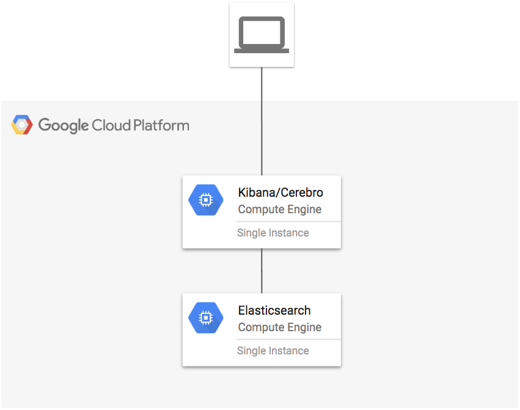

# Single node Elasticsearch

This example creates a single node Elasticsearch cluster.

**Figure 1.** *diagram of Google Cloud resources*



## Install Terraform

Install Terraform on Linux if it is not already installed (visit [terraform.io](https://terraform.io) for other distributions):

```
curl -sL https://goo.gl/UYp3WG | bash
source ${HOME}/.bashrc
```

## Setup Environment

```
cd examples/single-node
```

Set the project, replace `YOUR_PROJECT` with your project ID:

```
gcloud config set project YOUR_PROJECT
```

```
test -z DEVSHELL_GCLOUD_CONFIG && gcloud auth application-default login
export GOOGLE_PROJECT=$(gcloud config get-value project)
```

## Configure remote backend

Configure Terraform [remote backend](https://www.terraform.io/docs/backends/types/gcs.html) for the state file.

```
BUCKET=YOUR_BUCKET_NAME
PREFIX=YOUR_BUCKET_PREFIX
```

```
cat > backend.tf <<EOF
terraform {
  backend "gcs" {
    bucket     = "${BUCKET}"
    prefix     = "${PREFIX}"
  }
}
EOF
```

## Run Terraform

```
terraform init
terraform plan
terraform apply
```

## Testing

SSH into the Kibana host with port forwarding to Cerebro and Kibana:

```
eval $(ssh-agent)
ssh-add ~/.ssh/google_compute_engine
eval $(terraform output kibana)
```

Open a local browser to view Cerebro and Kibana:

`walkthrough spotlight-pointer devshell-web-preview-button "Open Web Preview and change port to 9000"`

`walkthrough spotlight-pointer devshell-web-preview-button "Open Web Preview and change port to 5601"`

## Cleanup

Exit the ssh session:

```
exit
```

Remove all resources created by terraform:

```
terraform destroy
```